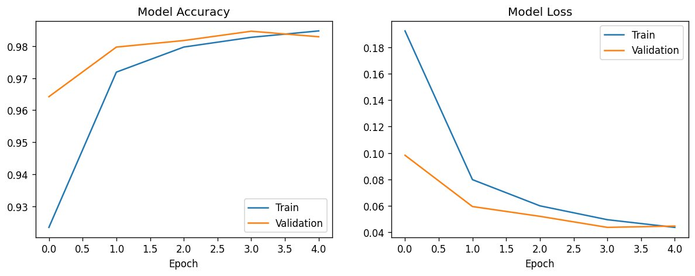
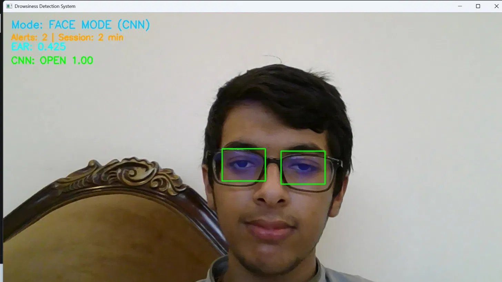
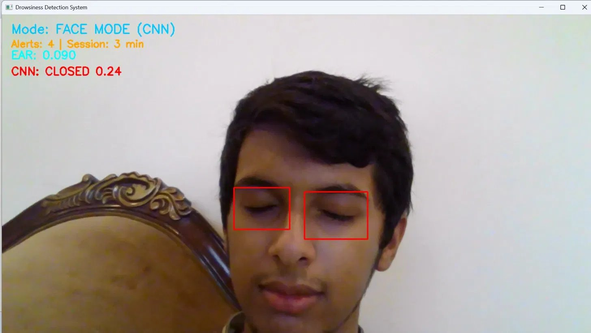
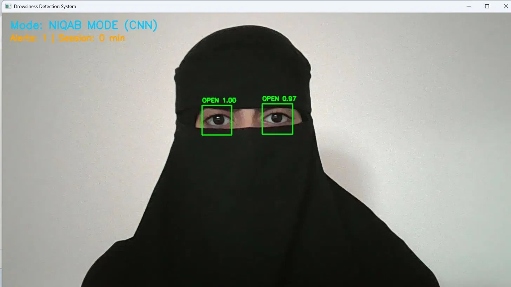
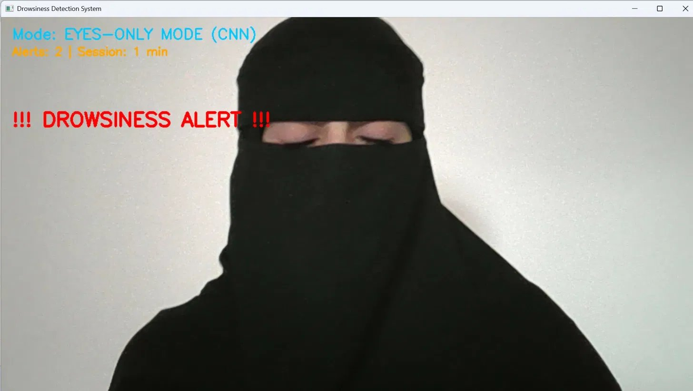

# Driver Drowsiness Detection with Real-Time Arabic Voice Alerts

A real-time computer-vision system that detects driver drowsiness from a webcam
and triggers an **Arabic voice alert** when the eyes stay closed for too long.

The system is built for the Saudi/Gulf context and includes a capability that
most existing drowsiness detectors lack: **it works on drivers wearing a niqab
(face veil)**, where only the eyes are visible.

At its core is a **Convolutional Neural Network (CNN) trained from scratch** to
classify eye state (open / closed), reaching **98.3% validation accuracy** on
~85,000 labeled eye images.

---

## Why this project

Drowsy driving is a major cause of road accidents. Commercial driver-monitoring
systems (now mandated in the EU) rely on seeing the full face — they are not
designed for the large population of niqab-wearing women in Saudi Arabia and the
Gulf. This project treats that case as a first-class requirement rather than an
edge case.

---

## Key features

- **Real-time eye-state detection** from a standard webcam.
- **Trained CNN classifier** (open vs. closed eyes), not a hand-tuned heuristic.
- **Three automatic modes**, selected by the system on its own:
  - `FACE MODE` — full face visible: MediaPipe Face Mesh locates the eyes, the CNN judges their state.
  - `NIQAB MODE` — face covering detected: MediaPipe landmarks are unreliable, so eye regions are located independently and judged by the CNN.
  - `EYES-ONLY MODE` — no face found at all (heavy occlusion): falls back to direct eye detection + CNN.
- **Automatic occlusion detection** — the system inspects the mouth region's texture to decide whether the face is covered, then switches modes.
- **Adaptive lighting correction** — gamma correction + CLAHE to handle darkness and harsh light.
- **Customizable Arabic voice alert** — the driver types their own warning phrase.
- **Live session dashboard** — current mode, alert count, and session duration.
- Modern Desktop GUI built with CustomTkinter.
- Live camera feed embedded inside the application.
- Custom Arabic voice alerts generated from user-defined text.


---

## How it works

```
Webcam frame
     │
     ▼
MediaPipe Face Mesh ──► face found? ──► is the face covered? (mouth-region texture)
     │                       │                   │
     │ no face               │ yes, uncovered    │ yes, covered (niqab/mask)
     ▼                       ▼                   ▼
EYES-ONLY MODE          FACE MODE            NIQAB MODE
(locate eyes directly)  (landmarks locate    (locate eyes independently
                         the eyes)            of the unreliable landmarks)
     │                       │                   │
     └───────────────► crop each eye ───────────┘
                            │
                            ▼
                   CNN: open / closed  ── eyes closed ≥ threshold time ──► Arabic voice alert
```

The CNN is the single decision-maker for eye state in every mode. MediaPipe and
the eye detector only *locate* the eyes; they never decide whether an eye is
open or closed. This separation is what lets the same trained model work whether
the face is bare, behind glasses, or behind a niqab.

---

## The CNN model

| | |
|---|---|
| **Dataset** | MRL Eye Dataset — ~85,000 infrared eye images, 37 subjects, with/without glasses, varied lighting |
| **Architecture** | 3 convolutional blocks (32 → 64 → 128) + dense head, ~683K parameters |
| **Input** | 64×64 grayscale eye crop |
| **Output** | Single sigmoid (open probability) |
| **Validation accuracy** | **98.3%** |
| **Training** | 5 epochs, Adam, binary cross-entropy, on Google Colab (T4 GPU) |

Train/validation curves stay close together, indicating the model generalized
rather than memorized:



---

## Demo

**Face mode (with glasses, a different test subject):**



**Closed-eye detection — the CNN flags closed eyes (red):**



**Niqab mode — eyes located and classified from under the veil:**



**Drowsiness alert firing on a niqab-wearing driver:**



---

## Project structure

```
.
├── app_gui.py                 # Desktop GUI application
├── main.py                    # Real-time detection engine
├── make_alert.py              # Generate custom Arabic voice alerts
├── eye_weights.weights.h5     # Trained CNN weights
├── requirements.txt
├── assets/
└── README.md
```

> The model is loaded by rebuilding the architecture in `main.py` and loading the
> trained weights from `eye_weights.weights.h5`. Keeping weights separate from the
> architecture avoids version-specific serialization issues across machines.

---
## Technologies Used

- Python
- TensorFlow
- Keras
- OpenCV
- MediaPipe
- CustomTkinter
- NumPy
- gTTS
- Pygame

  
## Setup & run

Requires **Python 3.10** and a webcam.

```bash
# 1. Create and activate a virtual environment
python -m venv venv
# Windows
.\venv\Scripts\activate
# macOS / Linux
source venv/bin/activate

# 2. Install dependencies
pip install -r requirements.txt

# 3. Create the Arabic voice alert (type your own phrase)
python make_alert.py

# 4. Run the system
python main.py

# 5. Run the desktop application
python app_gui.py
```

Press **`q`** to quit the window.

---

## Design decisions (a.k.a. interview notes)

- **Why train a CNN instead of using the Eye Aspect Ratio (EAR) alone?**
  EAR is a geometric ratio from facial landmarks. It breaks when landmarks are
  inaccurate — exactly what happens with a niqab. A CNN looks at the eye *image*
  itself, so it stays robust regardless of the rest of the face.

- **Why detect face covering via the mouth region?**
  When the face is veiled, MediaPipe still "finds" a face but places mouth/cheek
  landmarks on plain fabric. A covered mouth shows very low pixel-intensity
  variance (uniform cloth), which is a cheap, reliable signal to switch modes.

- **Why a square, fixed-size eye crop?**
  Cropping tightly to landmark extents collapses to a thin strip when the eye
  closes, distorting the image fed to the CNN. Cropping a fixed square around the
  eye *center* (sized by eye width, which barely changes when blinking) keeps the
  input consistent.

- **Why time-based alerting?**
  A single closed frame is just a blink. The alert only fires after the eyes stay
  closed beyond a time threshold, with a cooldown so the alarm doesn't repeat
  every frame.

---

## Limitations & future work

- Performance drops in near-total darkness (no camera can compensate for zero
  light); an infrared camera would address this, matching real in-car systems.
- Currently single-driver (one face) by design.
- Future:
- Add head-pose estimation.
- Add yawning detection.
- Build a mobile version.
- Deploy on edge devices (Raspberry Pi / Jetson Nano).
---

## Acknowledgements

- **MRL Eye Dataset** (Media Research Lab, VŠB-TU Ostrava) for the training data.
- **MediaPipe** (Google) for face-mesh landmarks.
- Inspired by EU driver-monitoring mandates, adapted for the Saudi context.
